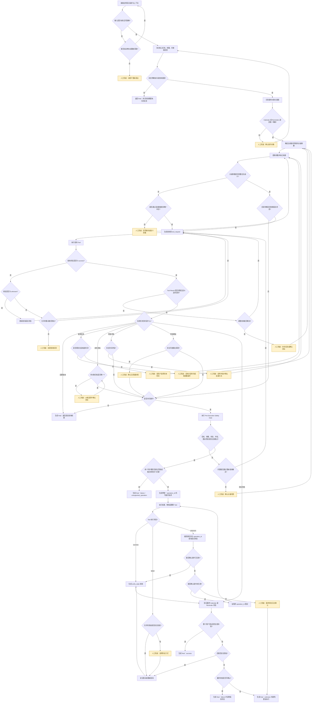

# 日程管家流程图

这张流程图对应“日程管家”Agent，用于检查从输入理解、状态查询、澄清、安全写入到最终状态验证的完整决策链路。

```mermaid
flowchart TD
    A[接收自然语言请求与上下文] --> B{输入是否有效且可理解?}

    B -- 否 --> B1{能否自动修复或重新获取?}
    B1 -- 是 --> A
    B1 -- 否 --> H1[人工兜底：请用户重新表达]
    B -- 是 --> C[拆分核心任务、参数、约束和背景]

    C --> D{存在明确执行或查询意图?}
    D -- 否 --> F0[返回 final：未识别到需要执行的任务]
    D -- 是 --> E[识别操作对象与意图]

    E --> E1{Calendar 或 Reminders 是否唯一明确?}
    E1 -- 否 --> H2[人工兜底：确认操作对象]
    E1 -- 是 --> G[确定当前操作所需的关键参数]

    G --> I[提取参数并标记来源]
    I --> J{关键参数是否完整且无歧义?}

    J -- 否 --> J1{能否通过真实数据查询唯一补全?}
    J1 -- 否 --> H3[人工兜底：澄清缺失或歧义参数]
    J1 -- 是 --> K[生成查询类 tool_request]
    J -- 是 --> L{后续判断是否依赖真实状态?}

    L -- 否 --> Q{是否为写操作?}
    L -- 是 --> K

    K --> M[执行查询 Tool]
    M --> N{查询状态是否为 success?}

    N -- 否 --> N1{状态是否为 unknown?}
    N1 -- 是 --> R1[重新查询真实状态]
    R1 --> K
    N1 -- 否 --> R2{允许的重试能否恢复?}
    R2 -- 是 --> K
    R2 -- 否 --> H4[人工兜底：处理查询失败]

    N -- 是 --> O{Tool Result 是否完整且足以支持目的?}
    O -- 否 --> O1{调整查询能否解决?}
    O1 -- 是 --> K
    O1 -- 否 --> H5[人工兜底：补充信息或确认目标]
    O -- 是 --> P{当前任务目的是什么?}

    P -- 回答查询 --> F1[生成 final：返回真实查询结果]
    P -- 查找空闲 --> P1{是否得到合适候选时间?}
    P1 -- 否 --> H6[人工兜底：没有合适时间或需调整条件]
    P1 -- 是 --> H7[人工兜底：请用户选择具体时间]

    P -- 定位目标 --> P2{单对象目标是否唯一?}
    P2 -- 否 --> H8[人工兜底：从候选项中确认目标]
    P2 -- 是 --> Q

    P -- 检查冲突 --> P3{存在时间冲突?}
    P3 -- 是 --> H9[人工兜底：说明冲突并确认处理方式]
    P3 -- 否 --> Q

    P -- 检查重复 --> P4{存在可能重复事项?}
    P4 -- 是 --> H10[人工兜底：确认沿用或新增]
    P4 -- 否 --> Q

    P -- 验证状态 --> V

    Q -- 否 --> F1
    Q -- 是 --> S[执行 Pre-Execution Safety Gate]

    S --> T{目标、参数、状态、冲突、重复检查是否全部通过?}
    T -- 否 --> T1{问题能否通过重新查询解决?}
    T1 -- 是 --> K
    T1 -- 否 --> H11[人工兜底：确认关键问题]

    T -- 是 --> U{单个写步骤是否通过范围或集合影响多个对象?}
    U -- 是 --> F6[生成 final：failure / unsupported_operation]
    U -- 否 --> W[生成带唯一 operation_id 的写操作请求]

    W --> X[执行创建、修改或删除 Tool]
    X --> Y{Tool 执行状态?}

    Y -- success --> Z[生成 verify_state 查询]
    Y -- failed --> Y1{允许的恢复能否安全完成?}
    Y1 -- 是 --> Y2[安全重试或重新查询]
    Y1 -- 否 --> H13[人工兜底：选择恢复方式]

    Y -- unknown --> Y3[使用原任务与 operation_id 查询真实状态]
    Y3 --> Y4{能否确认操作已生效?}
    Y4 -- 是 --> Z
    Y4 -- 否 --> Y5{能否确认操作未生效?}
    Y5 -- 是 --> Y6[复用原 operation_id 重试]
    Y5 -- 否 --> H14[人工兜底：最终状态无法确认]

    Y2 --> Z
    Y6 --> X
    Z --> V[验证最终 Calendar 或 Reminder 状态]

    V --> AA{整个用户目标是否全部实现?}
    AA -- 是 --> F3[生成 final：success]
    AA -- 否 --> AB{还能否安全恢复?}
    AB -- 是 --> Y2
    AB -- 否 --> AC{最终状态是否可确认?}
    AC -- 是 --> F4[生成 final：failure 并说明真实状态]
    AC -- 否 --> F5[生成 final：unknown 并避免重复执行]

    H2 --> C
    H3 --> I
    H5 --> G
    H6 --> G
    H7 --> I
    H8 --> P2
    H9 --> I
    H10 --> Q
    H11 --> G
    H13 --> Y2
    H14 --> F5

    classDef human fill:#FFF2CC,stroke:#D6B656,stroke-width:2px,color:#5F4B00;
    class H1,H2,H3,H4,H5,H6,H7,H8,H9,H10,H11,H13,H14 human;
```
